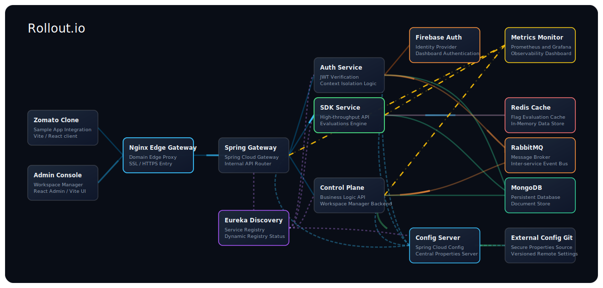
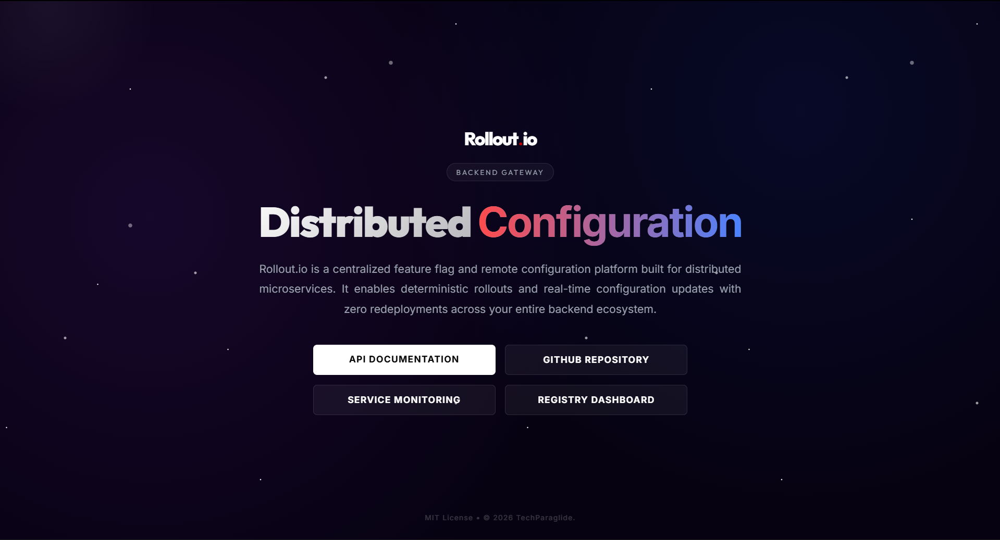
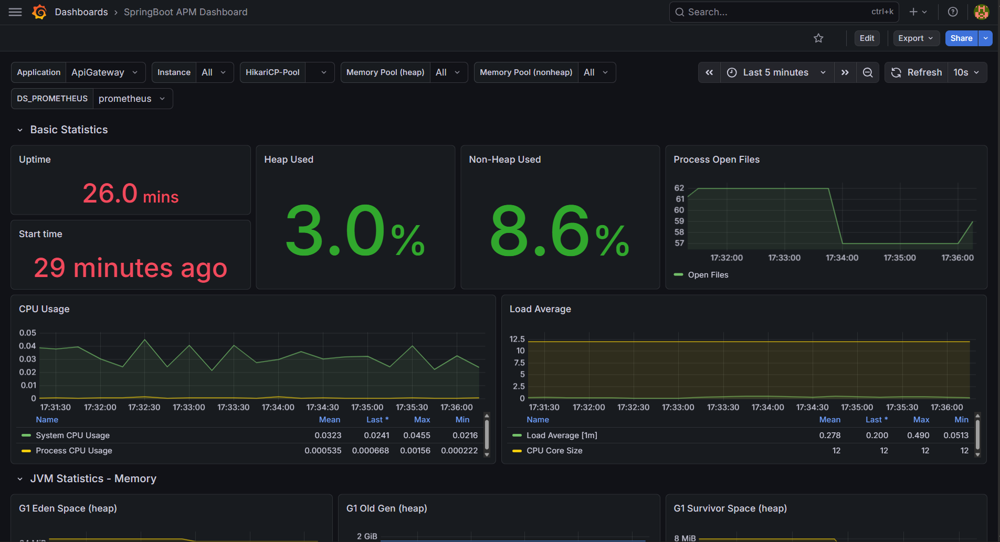

<div align="center">
  
  <h1 style="font-size: 3.5rem; font-weight: 800; margin: 15px 0 5px 0;">ROLLOUT.IO</h1>
  
  <p><b>The Architecture of Instant Change</b></p>
  <p>A centralized, ultra-low latency feature flag and configuration management system. Designed for complex distributed microservices architectures dealing with dynamic rendering and runtime execution layers.</p>

  <p>
    
    
    
    
    
    
  </p>

  <p style="font-size: 1.1rem; letter-spacing: 0.5px;">
    <b>Status: Completed and Deployed</b>
  </p>

  <table style="width: 100%; border-collapse: collapse; border: 1px solid #e2e8f0; margin-top: 15px;">
    <tr>
      <td style="border: 1px solid #e2e8f0; padding: 3px 15px; text-align: center; width: 16.66%;"><h5 style="margin: 0; display: inline-block;"><a href="https://rollout.paraglide.in" target="_blank">LIVE PROJECT</a></h5></td>
      <td style="border: 1px solid #e2e8f0; padding: 3px 15px; text-align: center; width: 16.66%;"><h5 style="margin: 0; display: inline-block;"><a href="REPORT/Rollout.io%20-%20Project%20Report.pdf">PROJECT REPORT</a></h5></td>
      <td style="border: 1px solid #e2e8f0; padding: 3px 15px; text-align: center; width: 16.66%;"><h5 style="margin: 0; display: inline-block;"><a href="SDK/">CLIENT SDKS</a></h5></td>
      <td style="border: 1px solid #e2e8f0; padding: 3px 15px; text-align: center; width: 16.66%;"><h5 style="margin: 0; display: inline-block;"><a href="LICENSE-MIT">MIT LICENSE</a></h5></td>
      <td style="border: 1px solid #e2e8f0; padding: 3px 15px; text-align: center; width: 16.66%;"><h5 style="margin: 0; display: inline-block;"><a href="LICENSE-APACHE">APACHE LICENSE</a></h5></td>
      <td style="border: 1px solid #e2e8f0; padding: 3px 15px; text-align: center; width: 16.66%;"><h5 style="margin: 0; display: inline-block;"><a href="mailto:rollout@paraglide.in">EMAIL SUPPORT</a></h5></td>
    </tr>
  </table>
</div>

## Overview

Rollout.io Remote Config is an enterprise-grade feature management platform that enables engineering teams to decouple deployment from release. By centralizing feature flags and configurations, applications can dynamically control features at runtime without initiating a redeployment sequence. It supports safe and targeted rollouts, instantaneous rollbacks, and synchronized configuration state across distributed systems, dramatically improving reliability in high-availability production environments.

## Live Production Demo

The complete Rollout.io ecosystem has been deployed and is accessible at **[rollout.paraglide.in](http://rollout.paraglide.in)**.

Through the integrated Nginx edge proxy configuration, all microservices, management interfaces, and demonstration components are accessible under the primary domain:

* **Launch Website**: **[rollout.paraglide.in](http://rollout.paraglide.in/)** - Developer landing portal and system overview page.
* **Admin Control Plane**: **[rollout.paraglide.in/app/](http://rollout.paraglide.in/app/)** - Core administrative dashboard used to govern environments and feature configurations.
* **Test Environment (Zomato Clone)**: **[rollout.paraglide.in/test/](http://rollout.paraglide.in/test/)** - Integration validation environment showing real-time, dynamic feature evaluation and flag resolution.
* **API Gateway and Documentation**: **[rollout.paraglide.in/gateway/](http://rollout.paraglide.in/gateway/)** - Central entry point containing interactive OpenAPI/Swagger definitions.
* **Service Registry (Eureka)**: **[rollout.paraglide.in/registry/](http://rollout.paraglide.in/registry/)** - Console displaying active microservice registration and system state.
* **Grafana Monitoring**: **[rollout.paraglide.in/grafana/](http://rollout.paraglide.in/grafana/)** - Real-time metrics dashboard for observing microservices performance and database access telemetry.

<br/>

<div align="center">
  
</div>

<br/>

## Distributed System Architecture

The core of Rollout.io is built on a highly scalable, fault-tolerant microservices architecture pattern, orchestrated via Docker and Spring Cloud. 

<div align="center">
  
</div>

The ecosystem comprises the following internal microservices and infrastructure components:
* **API Gateway (`port 80`)**: The central entry point handling rate limiting, CORS, and routing traffic to appropriate downstream microservices.
* **Service Registry (Eureka, `port 5000`)**: Handles dynamic service discovery and registration for all internal microservices.
* **Config Server**: Centralized configuration management across all environments, utilizing RabbitMQ message bus for real-time configuration propagation.
* **Auth Service**: Manages security, token validation, and access control.
* **Control Plane Service**: The administrative backend handling the business logic for feature flag creation, modification, and user targeting.
* **SDK Service**: A highly optimized, read-heavy API utilizing Redis caching to serve ultra-low latency flag evaluations to client SDKs.
* **Monitoring & Observability (`port 5001`)**: Integrated Prometheus and Grafana stack for real-time telemetry, metric aggregation, and system health monitoring.

<br/>

<div align="center">
  
</div>

<br/>

### Zero-Trust Context Isolation Pattern
Rollout.io implements a **Zero-Trust System Design** where the `Jwt` token serves as an immutable context boundary directly in the service layer. Rather than treating the token merely as an edge-validation mechanism at the Gateway, identity is directly extracted and enforced inside downstream microservices and repositories (e.g., `findByIdAndCreatedByUid`).
* This eliminates the risk of Insecure Direct Object Reference (**IDOR**) vulnerabilities out-of-the-box.
* Removes repetitive ownership validation logic (`if (entity.getUserId().equals(currentUserId))`).
* Prevents spoofing via client payloads by relying entirely on the security context for identity evaluation.

For a deeper dive into the theoretical foundation and trade-offs of this design pattern, read the complete engineering article: **[Zero-Trust System Design: How We Used JWT as an Immutable Context Boundary in Spring Boot](https://medium.com/@myself.parthsinh/zero-trust-system-design-how-we-used-jwt-as-an-immutable-context-boundary-in-spring-boot-42924aae086f)**.

### Event-Driven Cascading Deletion
Rollout.io implements an asynchronous, event-driven cascade deletion pipeline using RabbitMQ to guarantee database integrity. When a developer deletes their account, the downstream deletion executes in a non-blocking sequence:
1. **User Deletion Event**: The Auth Service deletes the user record and publishes a UserDeletedEvent to RabbitMQ.
2. **Project Cleanup**: The Control Plane Service consumes this event, queries all projects owned by the user, publishes a ProjectDeletedEvent for each, and deletes the projects.
3. **Environment Cleanup**: The service consumes the project events, identifies nested environments, publishes an EnvironmentDeletedEvent for each, and deletes the environments.
4. **Flag and Audit Log Purge**: The service consumes the environment events, executing the terminal deletion of all associated flags, rules, and audit logs.

### Centralized Configuration Server
All microservices in the Rollout.io ecosystem decouple their environment properties and secrets using Spring Cloud Config Server. At boot time:
* Microservices bootstrap by requesting configurations from the central Config Server (port 4998).
* The Config Server dynamically clones and serves properties from an external, secure Git repository (Rollout.io-External-Config.git).
* Any run-time configuration updates are broadcasted across the microservices ecosystem asynchronously using the RabbitMQ message broker.

## Repository Structure

```
├── ASSETS/         # Core system architecture and screenshot assets
├── DEPLOY/         # Docker Compose orchestration configurations
├── REPORT/         # Project documentation and engineering report
├── SDK/            # Client integration SDKs (Java and JavaScript)
├── SERVER/         # Spring Boot & Spring Cloud microservices
├── TEST/           # Demo integration applications (e.g., Zomato Clone)
└── UI/             # Admin Control Plane Dashboard (React/Vite frontend)
```

## Core Capabilities

* **Centralized Flag Management**: A unified control plane to govern all feature toggles across frontend and backend applications.
* **Zero-Downtime Execution**: Enable and disable features instantly without application restarts or CI/CD pipeline triggers.
* **Targeted Rollouts**: Gradual feature exposure based on user segmentation and precise contextual targeting.
* **Instantaneous Rollback**: Emergency kill switches to immediately disable malfunctioning features during cascading failures.
* **Project Isolation**: Segregated configuration handling across multiple distinct environments (e.g., Development, Staging, Production).
* **High-Throughput Telemetry**: Asynchronous usage reporting from SDKs to track flag evaluation metrics without blocking the main execution thread.

## Feature Comparison Matrix

| Capability | Rollout.io | LaunchDarkly | Unleash | Firebase |
| :--- | :--- | :--- | :--- | :--- |
| **System Architecture** | Distributed microservices orchestrated via Docker Compose | Monolithic hosted SaaS with optional Relay Proxy | Single-server or managed SaaS | Fully managed serverless backend |
| **Identity and Access Control** | Zero-Trust JWT enforced at every service layer; repositories bind identity directly (`findByIdAndCreatedByUid`) | API key-based project scoping with optional SSO | API token auth with role-based access control | Firebase Auth with Google Identity Platform |
| **Flag Value Types** | Boolean, String, Integer, Double, JSON | Boolean, String, Number, JSON | Boolean, String with strategy variants | String, Boolean, Number, JSON |
| **Targeting Rules** | Attribute-based rules with 7 operators: EQUALS, NOT_EQUALS, CONTAINS, GT, GTE, LT, LTE | Attribute-based targeting with custom rules | Strategy-based targeting with custom constraints | Conditions-based targeting by user property |
| **Percentage Rollout** | MurmurHash3 deterministic bucketing for consistent user-level percentage rollouts | Consistent hashing for percentage rollouts | Gradual rollout via activation strategies | Percentage rollouts by user property |
| **Flag Dependency Graph** | Recursive AND/OR dependency tree (RuleNode) with parent-child prerequisite evaluation | Sequential prerequisite dependency chains | No native flag dependency support | No native flag dependency support |
| **Real-Time Dashboard Updates** | MongoDB Change Streams piped through authenticated WebSocket connections | Webhook notifications and SSE streaming | SSE streaming with webhook support | No real-time dashboard sync |
| **Cache and Evaluation Latency** | Redis-backed cache with 30s background sync and MongoDB fallback | Edge-cached via Relay Proxy with SDK-side caching | In-memory SDK-side caching with polling | Client-side SDK caching with fetch intervals |
| **Event-Driven Data Lifecycle** | 4-stage async cascade deletion via RabbitMQ Topic Exchange | Manual deletion; no automated cascade | Manual deletion via API | Manual deletion via Console |
| **Service Discovery** | Netflix Eureka with auto-registration and dynamic gateway routing | Not applicable; single SaaS endpoint | Not applicable; single-server model | Not applicable; Google-managed |
| **Configuration Management** | Spring Cloud Config Server with Git-backed properties and RabbitMQ Cloud Bus propagation | SaaS dashboard settings | Environment variables and database config | Firebase Console parameters |
| **Gateway and Rate Limiting** | Spring Cloud Gateway + Nginx edge proxy with Redis per-user rate limiting | Built-in SaaS rate limiting by tier | No built-in rate limiting | Google Cloud infrastructure-level |
| **Observability Stack** | Prometheus + Grafana scraping Actuator metrics from all services | Proprietary analytics dashboard | Prometheus-compatible metrics endpoint | Firebase Analytics and Cloud Monitoring |
| **Client SDKs** | Java (JitPack) and JavaScript (npm) with async telemetry and polling | 25+ language SDKs with streaming and offline mode | 15+ language SDKs with polling | Android, iOS, Web, Unity SDKs |
| **Deployment Model** | Self-hosted Docker Compose with 14 containers and health checks | SaaS-only with optional Relay Proxy | Self-hosted or managed SaaS | SaaS-only |
| **Licensing** | Completely free and open-source under dual MIT and Apache 2.0; no paid tiers, no vendor lock-in | Proprietary; enterprise pricing at scale | Open-source core with paid enterprise tier | Free tier with usage-based pricing at scale |

## Technical Foundation

The platform leverages a modern, highly scalable distributed technology stack:

<div align="center">
  <a href="https://skillicons.dev">
    <br/>
    
  </a>
</div>

* **Frontend Rendering & Core**: React, Vite, React Router, React Query (TanStack), Zustand, XYFlow (React Flow), JavaScript, HTML5, CSS3
* **Execution Engine & Microservices**: Java 17, Spring Boot 3.x, Spring Cloud (Eureka Discovery, Config Server, Cloud Bus), RESTful APIs
* **Reverse Proxy & Routing**: Nginx (Edge Proxy & Gateway Router)
* **Persistence Layer**: MongoDB
* **Message Broker & Event-Driven Bus**: RabbitMQ
* **Caching & Low-Latency Store**: Redis
* **Authentication & Identity**: Firebase Authentication
* **Telemetry, Metrics & Observability**: Prometheus, Grafana
* **Cloud Infrastructure & OS**: Google Cloud Platform (GCP), Linux
* **Containerization & Deployment**: Docker, Docker Compose
* **API Documentation & Testing**: Swagger/OpenAPI, Postman Collection
* **Package Managers & Development Tools**: Maven, npm, Git, GitHub, VS Code, IntelliJ IDEA

## Application & Dashboard Demos

Here is a visual overview of the Rollout.io Admin Dashboard and the Zomato clone test application:

<table>
  <tr>
    <td align="center"><br><b>Rollout.io Control Plane Dashboard</b><br>The main workspace dashboard where developers can view, create, and manage multiple remote config projects.</td>
    <td align="center"><br><b>Project Management Window</b><br>Creating and managing multiple distinct operational configurations for feature isolation.</td>
  </tr>
  <tr>
    <td align="center"><br><b>Core Flag Management Window</b><br>Interactive environment-specific feature toggle and remote configuration console.</td>
    <td align="center"><br><b>Integrated JSON Editor in Dashboard</b><br>A fully interactive JSON editor allowing developers to update complex configuration objects safely at runtime.</td>
  </tr>
  <tr>
    <td align="center"><br><b>Dependent Flags Management</b><br>Configuring parent-child dependencies where a feature flag only evaluates to true if its parent flag is enabled first.</td>
    <td align="center"><br><b>Light Mode Test Application</b><br>Displaying the default white theme when the <code>zomato-dark-mode</code> feature flag is disabled.</td>
  </tr>
  <tr>
    <td align="center"><br><b>Test Application Dark Mode View</b><br>Testing features such as full-page dark mode using the <code>zomato-dark-mode</code> flag instantly.</td>
    <td align="center"><br><b>Zomato Offer Banner Live Testing</b><br>Real-time dynamic checkout logic and exclusive member discount banners evaluated from backend rules.</td>
  </tr>
</table>

## API Gateway & Documentation

For comprehensive API documentation and interactive testing, the centralized API Gateway includes built-in Swagger/OpenAPI documentation.

Additionally, a pre-configured Postman collection file is available to easily test API calls directly:
* **[Rollout.io Postman Collection](DEPLOY/Rollout.io%20-%20Rest%20-%20v5.0.1.postman_collection.json)**

To view the interface and test endpoints directly:
* **Local Development**: Start the infrastructure and navigate to **[http://localhost:80](http://localhost:80)**
* **Live Production**: Navigate directly to **[http://rollout.paraglide.in/gateway/](http://rollout.paraglide.in/gateway/)** (Swagger UI documentation endpoint)

<div align="center">
  
</div>

## Telemetry & Metrics Monitoring with Grafana

Rollout.io includes a pre-configured Prometheus and Grafana telemetry stack for real-time microservices performance and health monitoring.

To configure and view the dashboard:
1. Navigate to the monitoring interface (by default on port `5001` or as configured).
2. Head over to the **Service Monitoring** section in the sidebar.
3. Connect your **Prometheus** instance as the target data source to fetch real-time telemetry.
4. Import the **Spring APM Dashboard** to visualize CPU, memory, and API request performance.
5. Create and configure the **datasource variable** to ensure dynamic mapping of Spring Boot metrics across the microservices ecosystem.

<div align="center">
  
</div>

## Quick Start Guide

### Prerequisites
Make sure your system meets the minimum requirements and has the necessary dependencies installed:
* **System Memory**: Recommended minimum of **8 GB RAM** (16 GB preferred) due to running multiple Spring Boot microservices, databases, and message brokers concurrently.
* **Docker & Docker Compose** (Desktop/CLI)
* **Node.js** (v18.x or above)
* **Java SDK** (v17 or above)
* **Maven** (v3.8+)

### 1. Initialize the Ecosystem via Docker Compose

The complete Rollout.io ecosystem—including microservices, front-end portals, support databases, and monitoring telemetry—is containerized and orchestrated using Docker Compose.

To boot the entire architecture:

```bash
cd DEPLOY
docker-compose up -d
```

*Note: Due to the sequential startup dependencies inside the microservices topology, the orchestration uses delayed container initialization to ensure RabbitMQ and the Eureka Service Registry are fully operational before dependent services boot. The initial startup sequence may require 2 to 3 minutes to complete.*

To monitor the startup state and verify active containers:

```bash
docker ps
```

Once the stack is operational, the integrated Nginx edge proxy serves all components on port 80, replicating the production environment structure locally:

* **Launch Website**: **[http://localhost](http://localhost)**
* **Admin Control Plane**: **[http://localhost/app/](http://localhost/app/)**
* **Test Environment (Zomato Clone)**: **[http://localhost/test/](http://localhost/test/)**
* **API Gateway and Swagger Docs**: **[http://localhost/gateway/](http://localhost/gateway/)**
* **Service Registry (Eureka)**: **[http://localhost/registry/](http://localhost/registry/)**
* **Grafana Dashboard**: **[http://localhost/grafana/](http://localhost/grafana/)**

---

### Local Development Options

If you wish to run individual front-end components in development mode (e.g., for making live code changes) instead of using the pre-built containerized versions, you can shut down the respective containers in Docker and run the local development servers using the steps below.

### 2. Configure and Execute the Admin Control Plane (UI)
The Admin Dashboard requires Firebase Authentication for secure identity management. 

**Authentication Setup:**
Navigate to `UI/src/firebase.js` and inject your Firebase project configuration parameters:
```javascript
const firebaseConfig = {
  apiKey: "YOUR_API_KEY",
  authDomain: "YOUR_PROJECT.firebaseapp.com",
  projectId: "YOUR_PROJECT_ID",
  storageBucket: "YOUR_PROJECT.firebasestorage.app",
  messagingSenderId: "YOUR_SENDER_ID",
  appId: "YOUR_APP_ID",
  measurementId: "YOUR_MEASUREMENT_ID"
};
```

**Bootstrapping the UI Server:**
```bash
cd UI
npm install
npm run dev
```

### 3. Execute the Integration Test Environment (Zomato Clone)
To validate the Rollout.io SDK integration and observe real-time feature flagging, boot the pre-configured sample test application.

```bash
cd TEST/zomato-clone
npm install
npm start
```

## Supported Client SDKs

**JavaScript SDK (`@rollout.io/sdk-js`)**
Professional-grade, high-performance SDK designed for web-based rendering environments (Browser & Node.js).

Install the SDK via npm:
```bash
npm install "@rollout.io/sdk-js@latest"
```

**Usage Example:**
```javascript
import sdk from '@rollout.io/sdk-js';

// Initialize the SDK
await sdk.init({
  sdkKey: "YOUR_SDK_KEY",
  userId: "user-unique-id",
  baseUrl: "http://rollout.paraglide.in/gateway" // Live Production Gateway (or "http://localhost:80/gateway" for local)
});

// Evaluate flag value instantly (Fallback value is false)
const isFeatureEnabled = sdk.getFlag("zomato-dark-mode", false);

if (isFeatureEnabled) {
  // Execute feature specific logic
  console.log("Dark mode feature is active.");
}
```

Detailed implementation schematics available at: `SDK/javascript/README.md`

**Java SDK (`com.github.TechParaglide.Rollout.io:sdk-java`)**
Enterprise-grade SDK built utilizing native `HttpClient` for server-side Java and Spring Boot runtimes.

Since the Java SDK is distributed via JitPack, you must include the repository in your `pom.xml`:

```xml
<repositories>
    <repository>
        <id>jitpack.io</id>
        <url>https://jitpack.io</url>
    </repository>
</repositories>
```

Then, add the dependency:

```xml
<dependency>
    <groupId>com.github.TechParaglide</groupId>
    <artifactId>Rollout.io</artifactId>
    <version>5.0.5</version>
</dependency>
```

**Usage Example:**
```java
import com.rollout.io.sdk.RolloutClient;
import com.rollout.io.sdk.RolloutConfig;

// Initialize the SDK
RolloutClient client = new RolloutClient();
RolloutConfig config = new RolloutConfig(
    "YOUR_SDK_KEY",
    "user-unique-id",
    "http://rollout.paraglide.in/gateway" // Live Production Gateway (or "http://localhost:80/gateway" for local)
);

client.init(config);

// Evaluate flag value instantly (Fallback value is false)
boolean isNewCheckoutEnabled = client.getFlag("new-checkout", false);

if (isNewCheckoutEnabled) {
    // Execute feature specific logic
    System.out.println("Checkout feature is active.");
}
```

Detailed implementation schematics available at: `SDK/java/README.md`

## Future Scope / Roadmap

While the core ecosystem is complete and fully functional, future enhancements could include:
* **Additional SDKs**: Development of native Python, GoLang, and .NET client SDKs.
* **Advanced Analytics**: Built-in A/B testing analytics and conversion tracking based on flag evaluations.
* **Kubernetes Orchestration**: Official Helm charts for scalable Kubernetes cluster deployments.
* **Webhooks & CI/CD Integrations**: Automated flag toggles triggered by external GitHub Actions or CI/CD pipelines.

## Academic Context & Project Documentation

This system was architected and developed as a Final Year Project by scholars of the **Information Technology Department** at **Government Engineering College, Gandhinagar**.

* **Project Report:** The complete engineering project report, including microservices topology, sequence flows, and system designs is available at **[Rollout.io - Project Report.pdf](REPORT/Rollout.io%20-%20Project%20Report.pdf)**.

**Core Engineering Team:**

<table width="100%">
  <thead>
    <tr>
      <th align="left">Name</th>
      <th align="left">Enrollment No</th>
      <th align="left">Worked on Modules</th>
      <th align="left">LinkedIn Profile</th>
    </tr>
  </thead>
  <tbody>
    <tr>
      <td><b>Parthsinh R. Thakor</b></td>
      <td><code>220130116064</code></td>
      <td>Backend, Docker, Launch website, SDK, Test app</td>
      <td><a href="https://www.linkedin.com/in/parthsinh-thakor/"></a></td>
    </tr>
    <tr>
      <td><b>Dharmik S. Aslaliya</b></td>
      <td><code>220130116002</code></td>
      <td>Dashboard Module</td>
      <td><a href="https://www.linkedin.com/in/dharmikaslaliya/"></a></td>
    </tr>
    <tr>
      <td><b>Meet N. Parmar</b></td>
      <td><code>220130116036</code></td>
      <td>Dashboard Module</td>
      <td><a href="https://www.linkedin.com/in/parmar-meet-a97203244/"></a></td>
    </tr>
  </tbody>
</table>

## Acknowledgments

We would like to express our deepest gratitude to the individuals and organizations who supported this project:
* **Prof. Prashant Chaudhari** (Internal Guide) - For his continuous mentorship, technical guidance, and valuable feedback throughout the project lifecycle.
* **Dr. Komal Anadkat** (Head of Department, IT) - For providing the academic framework and encouragement to pursue industry-standard system design.
* **Mitra Media Labs** - For providing an excellent internship environment that inspired several core architectural concepts utilized in this ecosystem.
## Project Files and Directory

| Document / Resource | File Path | Description |
| :--- | :--- | :--- |
| Academic Project Report | [REPORT/Rollout.io - Project Report.pdf](REPORT/Rollout.io%20-%20Project%20Report.pdf) | Complete engineering capstone report containing microservice designs, sequence diagrams, and architecture analysis. |
| Java Integration SDK | [SDK/java/README.md](SDK/java/README.md) | Integration guide, dependency setup, and usage examples for the Java SDK. |
| JavaScript Integration SDK | [SDK/javascript/README.md](SDK/javascript/README.md) | Integration guide, package details, and usage examples for the JavaScript SDK. |
| Production Docker Compose | [DEPLOY/docker-compose.yml](DEPLOY/docker-compose.yml) | Configuration for spinning up the production-ready microservices stack including Redis, RabbitMQ, and monitoring. |
| Development Docker Compose | [SERVER/docker-compose.yml](SERVER/docker-compose.yml) | Configuration for running microservices in development mode. |
| Postman API Collection | [DEPLOY/Rollout.io - Rest - v5.0.1.postman_collection.json](DEPLOY/Rollout.io%20-%20Rest%20-%20v5.0.1.postman_collection.json) | Centralized Postman collection covering microservices authentication, flag evaluations, and management endpoints. |
| Contributing Guide | [CONTRIBUTING.md](CONTRIBUTING.md) | Guidelines for reporting issues, contributing code, and setting up local development environment. |
| Security Policy | [SECURITY.md](SECURITY.md) | Procedures and contact details for reporting security vulnerabilities privately. |
| Support Guide | [SUPPORT.md](SUPPORT.md) | Available support channels and troubleshooting instructions for the platform. |
| Code of Conduct | [CODE_OF_CONDUCT.md](CODE_OF_CONDUCT.md) | Community guidelines and collaboration standards for students and developers. |
| License Information (MIT) | [LICENSE-MIT](LICENSE-MIT) | Terms and permissions under the MIT open-source license. |
| License Information (Apache) | [LICENSE-APACHE](LICENSE-APACHE) | Terms and permissions under the Apache 2.0 open-source license. |
| Citation File | [CITATION.cff](CITATION.cff) | Metadata citation file for referencing this academic project. |

## License

This project is dual-licensed under the **MIT License** and the **Apache License 2.0**. Reference the [LICENSE-MIT](LICENSE-MIT) and [LICENSE-APACHE](LICENSE-APACHE) files for full terms and conditions.
