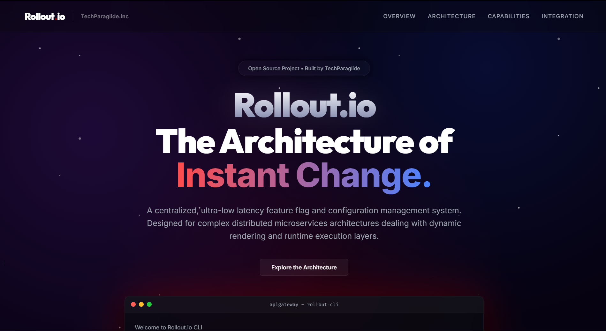

<div align="center">
  

  <h1>Rollout.io</h1>

  <p><b>The Architecture of Instant Change.</b></p>
  <p>A centralized, ultra-low latency feature flag and configuration management system. Designed for complex distributed microservices architectures dealing with dynamic rendering and runtime execution layers.</p>
</div>

<hr />

## Overview

Rollout.io Remote Config is an enterprise-grade feature management platform that enables engineering teams to decouple deployment from release. By centralizing feature flags and configurations, applications can dynamically control features at runtime without initiating a redeployment sequence. It supports safe and targeted rollouts, instantaneous rollbacks, and synchronized configuration state across distributed systems, dramatically improving reliability in high-availability production environments.

## Distributed System Architecture

The core of Rollout.io is built on a highly scalable, fault-tolerant microservices architecture pattern, orchestrated via Docker and Spring Cloud. 

<div align="center">
  
</div>

The ecosystem comprises the following internal microservices and infrastructure components:
* **API Gateway (`port 80`)**: The central entry point handling rate limiting, CORS, and routing traffic to appropriate downstream microservices.
* **Service Registry (Eureka, `port 5000`)**: Handles dynamic service discovery and registration for all internal microservices.
* **Config Server**: Centralized configuration management across all environments, utilizing RabbitMQ message bus for real-time configuration propagation.
* **Auth Service**: Manages security, token validation, and access control.
* **Control Plane Service**: The administrative backend handling the business logic for feature flag creation, modification, and user targeting.
* **SDK Service**: A highly optimized, read-heavy API utilizing Redis caching to serve ultra-low latency flag evaluations to client SDKs.
* **Monitoring & Observability (`port 5001`)**: Integrated Prometheus and Grafana stack for real-time telemetry, metric aggregation, and system health monitoring.

## Core Capabilities

* **Centralized Flag Management**: A unified control plane to govern all feature toggles across frontend and backend applications.
* **Zero-Downtime Execution**: Enable and disable features instantly without application restarts or CI/CD pipeline triggers.
* **Targeted Rollouts**: Gradual feature exposure based on user segmentation and precise contextual targeting.
* **Instantaneous Rollback**: Emergency kill switches to immediately disable malfunctioning features during cascading failures.
* **Project Isolation**: Segregated configuration handling across multiple distinct environments (e.g., Development, Staging, Production).
* **High-Throughput Telemetry**: Asynchronous usage reporting from SDKs to track flag evaluation metrics without blocking the main execution thread.

## Technical Foundation

The platform leverages a modern, highly scalable distributed technology stack:
* **Frontend Rendering**: React, Vite
* **Execution Engine**: Java 17, Spring Boot, Spring Cloud, RESTful APIs
* **Persistence Layer**: MongoDB
* **Message Broker**: RabbitMQ
* **Caching & Low-Latency Store**: Redis
* **Telemetry & Observability**: Prometheus, Grafana
* **Containerization**: Docker, Docker Compose

## Application & Dashboard Demos

Here is a visual overview of the Rollout.io Admin Dashboard and the Zomato clone test application:

| Rollout.io Admin Dashboard | Zomato Test Application Integration |
| :---: | :---: |
| <br>**Rollout.io Control Plane Dashboard**<br>The main workspace dashboard where developers can view, create, and manage multiple remote config projects. | <br>**Zomato Clone Integrated in Light Mode**<br>A beautiful food delivery frontend evaluating features like search placeholder text via the remote config platform. |
| <br>**Environment Management System**<br>Managing distinct operational environments (Development, Testing, Production) with project keys and targeting details. | <br>**Zomato Clone Live Theme Evaluation**<br>Testing features such as full-page dark mode using the `zomato-dark-mode` flag instantly. |
| <br>**Feature Flag Control Console**<br>Interactive toggles and advanced rules for individual flags, including zero-downtime emergency kill switches. | <br>**Test App Dynamic Feature Visibility**<br>Real-time conditional rendering of sections like 'Top Brands' using the `zomato-show-top-brands` flag. |
| <br>**Contextual Targeting Logic**<br>Configuring precise user conditions and JSON data payloads for flags like `zomato-offers-config`. | <br>**Zomato Offer Banner Live Testing**<br>Real-time dynamic checkout logic and exclusive member discount banners evaluated from backend rules. |

## Quick Start Guide

### 1. Initialize the Backend Infrastructure
The entire backend ecosystem (microservices, databases, caching layers, and message brokers) is containerized and orchestrated using Docker Compose.

```bash
cd DEPLOY
docker-compose up -d
```
*Note: Due to the complexity of the microservices topology, the orchestration uses delayed startup strategies (sleep intervals) to ensure infrastructural dependencies (RabbitMQ, Eureka) are fully initialized before downstream services boot. Initial boot sequence may take 2-3 minutes.*

Verify the container execution state utilizing:
```bash
docker ps
```

### 2. Configure and Execute the Admin Control Plane (UI)
The Admin Dashboard requires Firebase Authentication for secure identity management. 

**Authentication Setup:**
Navigate to `UI/src/firebase.js` and inject your Firebase project configuration parameters:
```javascript
const firebaseConfig = {
  apiKey: "YOUR_API_KEY",
  authDomain: "YOUR_PROJECT.firebaseapp.com",
  projectId: "YOUR_PROJECT_ID",
  storageBucket: "YOUR_PROJECT.firebasestorage.app",
  messagingSenderId: "YOUR_SENDER_ID",
  appId: "YOUR_APP_ID",
  measurementId: "YOUR_MEASUREMENT_ID"
};
```

**Bootstrapping the UI Server:**
```bash
cd UI
npm install
npm run dev
```

### 3. Execute the Integration Test Environment (Zomato Clone)
To validate the Rollout.io SDK integration and observe real-time feature flagging, boot the pre-configured sample test application.

```bash
cd TEST/zomato-clone
npm install
npm start
```

## Supported Client SDKs

**JavaScript SDK (`@techparaglide/sdk-js`)**
Professional-grade, high-performance SDK designed for web-based rendering environments (Browser & Node.js).

```bash
npm install @techparaglide/sdk-js@latest
```
Detailed implementation schematics available at: `SDK/javascript/README.txt`

**Java SDK (`com.rollout.io:sdk-java`)**
Enterprise-grade SDK built utilizing native `HttpClient` for server-side Java and Spring Boot runtimes.

```xml
<dependency>
    <groupId>com.rollout.io</groupId>
    <artifactId>sdk-java</artifactId>
    <version>5.0.1</version>
</dependency>
```
Detailed implementation schematics available at: `SDK/java/README.md`

## Academic Context & Engineering Team

This system was architected and developed as a Final Year Project by scholars of the **Information Technology Department** at **Government Engineering College, Gandhinagar**.

**Core Engineering Team:**
* Parthsinh R. Thakor
* Dharmik S. Aslaliya
* Meet N. Parmar

## License

This project is distributed under the **MIT License**. Reference the `LICENSE` file for full terms and conditions.
